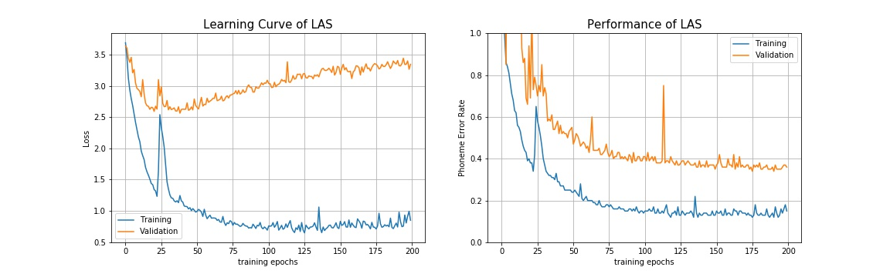
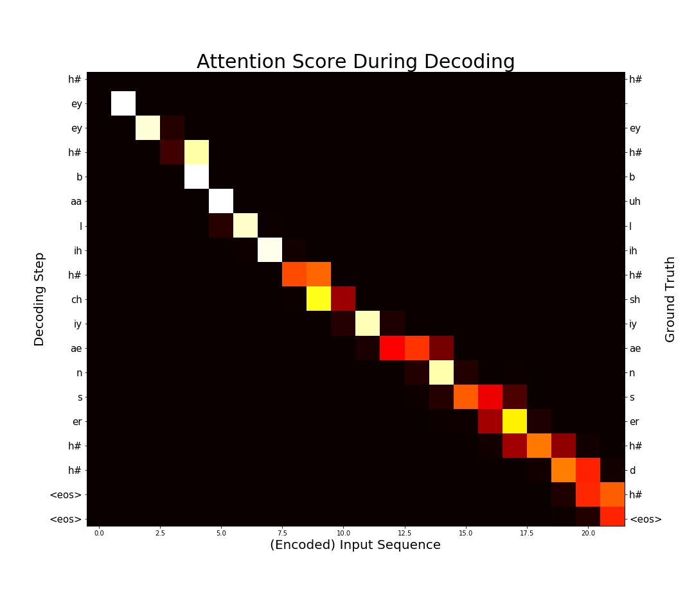

# Listen, Attend and Spell - PyTorch Implementation

## Description

This is a PyTorch implementation of [Listen, Attend and Spell](https://arxiv.org/abs/1508.01211v2) (LAS)  published in ICASSP 2016 (Student Paper Award).
Please feel free to use/modify them, any bug report or improvement suggestion will be appreciated.

This implement achieves about 34% phoneme error rate on TIMIT's testing set (using original setting in the paper without hyper parameter tuning, models are stored in [`checkpoint/`](checkpoint/)). It's not a remarkable score but please notice that deep end2end ASR without special designed loss function such as LAS requires larger corpus to achieve outstanding performance.

#### Learning Curve

#### Attention Visualization & Recognition Result

Result of the first sample in TIMIT testing set.

#### Remarks

The input feature is MFCC 39 (13+delta+accelerate), and the output phoneme classes is reduced from 61 to 39 classes during evaluation.

Be aware of some differences between this implementation and the originally proposed model:

- Smaller Dataset

    Originally, LAS was trained on Google's private voice search dataset representing 2000 hours of data plus additional data augmentation. Here the model was trained on [TIMIT](https://catalog.ldc.upenn.edu/ldc93s1), a MUCH smaller dataset, without any data augmentation.

- Different Target

    Evaluation criterion is [Word Error Rate (WER)](https://en.wikipedia.org/wiki/Word_error_rate) on the output phoneme (61 classes in TIMIT) sequence instead of real sentences composed of real words.

- Simplified Speller

    Speller contains a single layer LSTM instead of 2 layer LSTM proposed. According to the response I got from a letter I wrote to the author, using single layer can get similar result.

If you have any questions, please contact b03902034[AT]ntu.edu.tw

## Requirements

##### Execution Environment

- Python 3
- GPU computing is recommended for training efficiency

##### Packages for TIMIT preprocessing

- [SoX](http://sox.sourceforge.net/)

    Command line tool for transforming raw wave file in TIMIT from NIST to RIFF

- [python_speech_features](https://github.com/jameslyons/python_speech_features)

    A Python package for extracting MFCC features during preprocessing

##### Packages for LibriSpeech preprocessing

- [pydub](https://github.com/jiaaro/pydub)

    High level api for audio file format tranlation

- [python_speech_features](https://github.com/jameslyons/python_speech_features)

    A Python package for extracting MFCC features during preprocessing

- joblib
    
    Parallel tool to speed up feature extraction.

- tdqm

    Progress bar for visualization.

##### Packages for running LAS model

- [PyTorch](http://pytorch.org/) (0.3.0 or later version)

    Please use PyTorch after version 0.3.0 in which the [softmax bug](https://github.com/pytorch/pytorch/issues/1020) on 3D input is fixed.

- [editdistance](https://github.com/aflc/editdistance)

    Package for calculating edit distance (Levenshtein distance).

- [tensorboardX](https://github.com/lanpa/tensorboard-pytorch)

    Tensorboard interface for pytorch, we used it to visualize training process.

- [pandas](https://pandas.pydata.org/)

    For LibriSpeech dataset loading.

## Setup
- TIMIT Dataset Preprocess

    Please prepare TIMIT dataset without modifying the file structure of it and run the following command to preprocess it from wave to MFCC 39 before training.

        cd util
        ./timit_preprocess.sh <TIMIT folder>       

    After preprocessing step, `timit_mfcc_39.pkl` should be in your TIMIT folder. Add your data path to config file.

- LibriSpeech Dataset Preprocess

    Download [LibriSpeech](http://www.openslr.org/12/) and extract it. Run the following command to process from wave to log-mel filter bank feature. 

        cd util
        ./librispeech_preprocess.sh <LibriSpeech folder> 

    Note that the script is an example using clean dataset only. For more arguments and instruction preprocessing LibriSpeech, please run

        python3 util/librispeech_preprocess.py -h

    After preprocessing step, `train.csv`/`test.csv`/`dev.csv`/`idx2chap.csv` should be in your LibriSpeech folder. Extracted feature is stored in npy format.

- LAS Model
  ​      
        mkdir -p checkpoint
        mkdir -p log
        python3 run_exp.py <config file path>

    Training log will be stored at `log/` while model checkpoint at ` checkpoint/`

    For a customized experiment, please read and modify [`config/las_example_config.yaml`](config/las_example_config.yaml)

    For more information and a simple demonstration, please refer to [`las_demo.ipynb`](las_demo.ipynb)

## ToDo

- Experiment on LibriSpeech dataset

## Acknowledgements
- Special thanks to [William Chan](http://williamchan.ca/), the first author of LAS, for answering my questions during implementation.
- Thanks [xiaoming](https://github.com/lezasantaizi) for identifying several issues in our implementation.

## References
- TIMIT preprocessing : https://github.com/Faur/TIMIT
